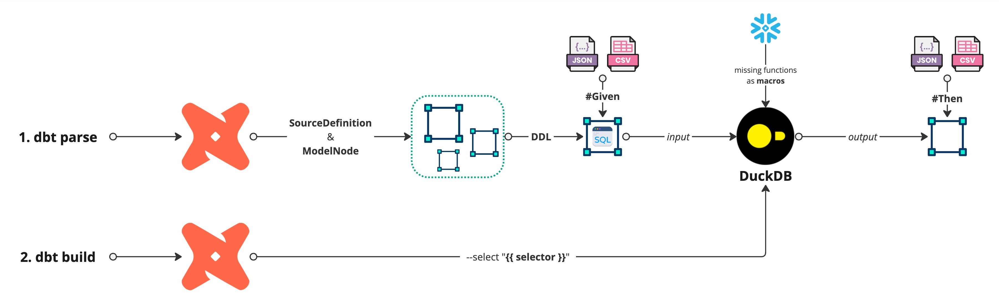

# :material-lightbulb-on: Usage

This guide explains how to configure, define, and execute end-to-end tests for dbt models using pytest-dbt-duckdb.

- [x] Define test scenarios in YAML
- [x] Configure dbt with profiles.yml
- [x] Run tests locally using DuckDB
- [x] Integrate tests seamlessly into CI/CD pipelines

---
## :octicons-gear-24:️ Project Configuration

## :material-download: Installation

!!! tip "Step 1: Install package"
    Install the package using pip:

```shell
pip install pytest-dbt-duckdb
```

!!! tip "Step 2: Create profiles.yml"
    Configure dbt to use DuckDB as the testing engine by adding this to your profiles.yml file:

```yaml title="profiles.yml"
pytest:
  target: duckdb
  outputs:
    duckdb:
      type: duckdb
      path: "{{ env_var('DBT_DUCKDB_PATH') }}"
      database: "{{ env_var('DBT_DUCKDB_DATABASE') }}"
      schema: "dbt_pytest_gummy"
```

!!! tip "Step 3: Define Environment Variables"
    In order for dbt to work correctly, set the required environment variables in pytest.ini:

```ini
[tool.pytest.ini_options]
minversion = "7.0"
addopts = "-p no:warnings"
testpaths = ["tests"]
env = [
    "DBT_RAW_DATABASE = pyduck",
    "DBT_DATABASE_NAME = pyduck",
    "DBT_PROFILE = pytest"
]
```

## :material-note-edit: Writing a Test Scenario

<figure markdown="span">
  { width=750 }
</figure>

!!! abstract "Structure of a YAML Test"
    Each test follows this structure:

- **`id`**: test unique identifier.
- **`given`**: Input datasets (CSV/JSON files) to load.
- **`seed`**: dbt seeds to be executed.
- **`build`**: dbt models to be executed.
- **`then`**: Expected outputs after transformation.

---

## :simple-pytest: Test Case Example

```yaml title="test_tasks.yaml"
tests:
  - id: Validate full project
    given:
      - schema: netflix
        table: shows
        path: 'e2e/given/netflix_titles.csv'
    seed: seed_show_ratings
    build: '+int_show+'
    then:
      - schema: 'dbt_pytest_gummy'
        table: 'fct_director'
        path: 'e2e/then/fct_director.csv'
      - schema: 'dbt_pytest_gummy'
        table: 'fct_cast'
        path: 'e2e/then/fct_cast.csv'
```

---

## :simple-pytest: Running the Tests

```python title="test_dbt.py"
import pytest
from pytest_dbt_duckdb.plugin import DuckFixture, TestFixture, load_yaml_tests

yaml_data = list(load_yaml_tests("tests/data"))

@pytest.mark.parametrize("fixture", yaml_data, ids=[x.id for x in yaml_data])
def test_dbt_scenarios(fixture: TestFixture, duckdb_fixture: DuckFixture):
    duckdb_fixture.execute_dbt(
        nodes_to_load=fixture.given,
        seed=fixture.seed,
        build=fixture.build,
        nodes_to_validate=fixture.then,
        resources_folder="tests/data",
        dbt_project_dir=".",
    )
```


## :octicons-alert-24:️ Hard Requirement: Defining dbt Data Types
!!! warning "Mandatory: Define Column Data Types"
    For pytest-dbt-duckdb to function correctly, all models in the **given** and **then** sections
    must have explicitly defined dbt column [data types](https://docs.getdbt.com/sql-reference/data-types).

### Why is this Required?
Since the framework recreates models inside DuckDB, it needs accurate data type definitions to:

- [x] Ensure proper table creation in DuckDB
- [x] Prevent type mismatches between expected vs. actual results
- [x] Avoid errors when populating test data

How to Define Column Types in dbt
Ensure that every model in given and then is properly defined in your dbt project under schema.yml:

```yaml title="schema.yml"
version: 2
models:
  - name: stg_show_rating
    description: Map file with Rating System age & audiences
    columns:
      - name: rating_id
        description: Unique Rating Identifier
        data_type: text
        data_test:
          - not_null
          - unique
      - name: rating_name
        description: Readable Rating name
        data_type: text
      - name: only_adults
        description: Flag to indicate if the show aims to be watched by only adults
        data_type: boolean
      - name: min_age
        description: Suitable for people over this age
        data_type: integer
        data_tests:
          - dbt_utils.accepted_range:
              min_value: 2
              max_value: 18
              inclusive: true
```

### What Happens if You Skip This?
- :octicons-x-circle-24: If column types are not defined, the framework **cannot recreate** and populate the test models inside DuckDB.
- :octicons-x-circle-24: This will result in test failures due to schema mismatches and incorrectly inferred types.

:octicons-arrow-right-24: **Solution**: Always define your dbt column types properly to ensure reliable testing.

---

## :material-recycle-variant: Running with Custom DuckDB Functions

!!! info "Extending DuckDB with Custom Functions"
    If you need to extend the DuckDB engine with additional functionality, you can define custom functions:

```python title="test_with_udfs.py"
from pytest_dbt_duckdb.connector import DuckFunction, ExtraFunctions

extra_functions = ExtraFunctions(
    functions=[
        DuckFunction(name="tokenize", function=tokenize, parameters=[str], return_type=list[str]),
        DuckFunction(name="edit_distance", function=edit_distance, parameters=[str, str, int], return_type=int),
    ]
)
```

Pass `extra_functions` to `execute_dbt` when running tests.

---

## :material-play-circle: Explore Testing Examples
Want to see pytest-dbt-duckdb in action? Check out our real test scenarios in the GitHub repository:
:material-github: [GitHub Repository - Testing Examples](https://github.com/afranzi/pytest-dbt-duckdb/tree/main/tests)

These examples include:

- [x] Predefined YAML test cases
- [x] Sample dbt projects
- [x] Fully configured pytest setup

Use them as a starting point for writing your own end-to-end dbt model tests!

---

## :material-speedometer: Running tests in parallel

!!! tip "Use pytest-xdist for fan-out"
    The plugin keeps a single DuckDB file per xdist worker (stable `DBT_DUCKDB_PATH`),
    resets state between tests by dropping user schemas, and caches the parsed dbt
    `Manifest` per worker so every `dbt build`/`dbt seed` after the first skips the
    parse step. Tune the worker count to your CI's CPU count — `-n 4` on a 4-vCPU
    runner usually beats `-n auto`, since oversubscription costs more than it saves.

```shell
pip install "pytest-dbt-duckdb[parallel]"   # pulls in pytest-xdist
pytest -n 4                                 # match your runner's vCPU count
```

How isolation is split:

- **Per test** — DuckDB content (every non-system schema is dropped between tests).
- **Per xdist worker** — DuckDB file path, dbt `target/` and `logs/`, in-memory parsed
  `Manifest` (`_MANIFEST_CACHE`) and column metadata (`_PARSE_CACHE`).

Tradeoff: the first test on each worker pays a cold parse. Every subsequent test
in that worker reuses the cached manifest. Round-robin scheduling (`pytest -n N`
without `--dist loadfile`) gives every worker exactly one cold parse no matter how
many tests it runs.

---

## :material-stopwatch: Profiling slow tests

!!! tip "Find out where each test's seconds are going"
    When tests get slow in CI, run with `--duckdb-profile` to get a breakdown of
    where the time is spent — per stage, per test, per worker.

```shell
pytest --duckdb-profile               # serial
pytest --duckdb-profile -n auto       # xdist; one table per worker plus an aggregate
```

The profiler is opt-in. With the flag off, instrumentation is a no-op and adds
no measurable overhead.

Stages reported:

- **`load_given`** — populating DuckDB source tables from CSV/JSON fixtures.
- **`dbt_seed`** — `dbt seed --select <selector>`.
- **`dbt_build`** — `dbt build --select <selector>`.
- **`validate_then`** — fetching outputs and `assert_frame_equal` against expected fixtures.
- **`dbt_invoke:<command>`** — wall time of each individual `dbtRunner.invoke` call (sub-stage; counted inside `dbt_seed` / `dbt_build` / parse).
- **`parse_project:hit` / `parse_project:miss`** — in-memory manifest cache hits and misses. If you see many misses, your `extra_vars` are probably differing across tests.

The `total` column in the per-test table sums only the four primary stages, so it
reflects the wall time inside `DbtValidator.validate` (sub-stages aren't double-counted).

---

## :material-history: Behavioural changes in 0.1.19

- **`DuckConnector` no longer auto-closes its connection.** The destructor (`__del__`)
  was closing the underlying DuckDB connection at unpredictable garbage-collection
  times, which became unsafe once the fixture started reusing connections across tests.
  If you instantiate `DuckConnector` directly (rather than going through the
  `duckdb_fixture`), you now own the connection lifecycle — close it yourself or use
  the `with` context manager (`__enter__` / `__exit__` still close on exit).
- **DuckDB file path is now per-worker, not per-test.** State isolation between tests
  comes from dropping every non-system schema; the file (and its registered UDFs and
  `partial_parse.msgpack`) survives across tests in the same worker, which is what
  enables the parse-skipping speedup.
- **Consumer-supplied `extra_functions.macros` are now wrapped to `CREATE OR REPLACE
  MACRO` automatically** before execution. Already-idempotent forms
  (`CREATE OR REPLACE MACRO`, `CREATE MACRO IF NOT EXISTS`) pass through unchanged.

---

## :octicons-light-bulb-24: Summary
- Define input data (given), models to build (build), and expected outputs (then).
- Configure dbt using profiles.yml and environment variables.
- Run tests locally with DuckDB for fast execution.
- Integrate tests with CI/CD pipelines to prevent regressions.
- Extend with custom DuckDB functions for advanced testing.
